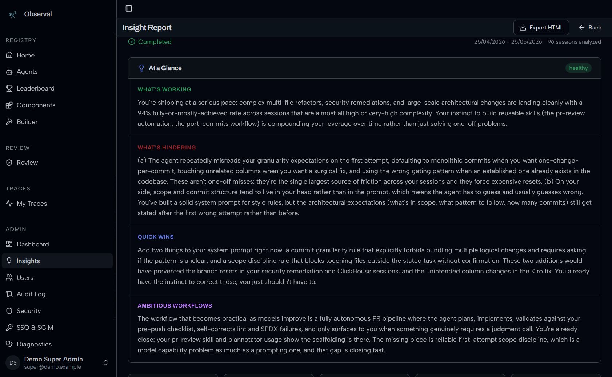

<!-- SPDX-FileCopyrightText: 2026 Ai-chan-0411 <aoikabu12@gmail.com> -->
<!-- SPDX-FileCopyrightText: 2026 Apoorv Garg <apoorvgarg.21@gmail.com> -->
<!-- SPDX-FileCopyrightText: 2026 Aryan Iyappan <aryaniyappan2006@gmail.com> -->
<!-- SPDX-FileCopyrightText: 2026 Subramania Raja <dhanpraja231@gmail.com> -->
<!-- SPDX-FileCopyrightText: 2026 Hari Srinivasan <harisrini21@gmail.com> -->
<!-- SPDX-FileCopyrightText: 2026 Hemalatha Madeswaran <hemalathamadeswaran@gmail.com> -->
<!-- SPDX-FileCopyrightText: 2026 Kaushik Kumar <kaushikrjpm10@gmail.com> -->
<!-- SPDX-FileCopyrightText: 2026 Lokesh Selvam <lokeshselvam7025@gmail.com> -->
<!-- SPDX-FileCopyrightText: 2026 Naraen Rammoorthi <naraen13@gmail.com> -->
<!-- SPDX-FileCopyrightText: 2026 Shaan Narendran <shaannaren06@gmail.com> -->
<!-- SPDX-FileCopyrightText: 2026 Shreem Seth <shreemseth26@gmail.com> -->
<!-- SPDX-FileCopyrightText: 2026 DoomsCoder <vedantkakade05@gmail.com> -->
<!-- SPDX-FileCopyrightText: 2026 Vishnu Muthiah <vishnu.muthiah04@gmail.com> -->
<!-- SPDX-License-Identifier: AGPL-3.0-only -->

<pre>
 ██████╗ ██████╗ ███████╗███████╗██████╗ ██╗   ██╗ █████╗ ██╗
██╔═══██╗██╔══██╗██╔════╝██╔════╝██╔══██╗██║   ██║██╔══██╗██║
██║   ██║██████╔╝███████╗█████╗  ██████╔╝██║   ██║███████║██║
██║   ██║██╔══██╗╚════██║██╔══╝  ██╔══██╗╚██╗ ██╔╝██╔══██║██║
╚██████╔╝██████╔╝███████║███████╗██║  ██║ ╚████╔╝ ██║  ██║███████╗
 ╚═════╝ ╚═════╝ ╚══════╝╚══════╝╚═╝  ╚═╝  ╚═══╝  ╚═╝  ╚═╝╚══════╝
</pre>

**Discover, share, and monitor AI coding agents with full observability built in.**

<p>
  <a href="LICENSE"></a>
  
  <a href="https://pypi.org/project/observal-cli/"></a>
  <a href="https://codecov.io/gh/BlazeUp-AI/Observal"></a>
  <a href="https://github.com/BlazeUp-AI/Observal/graphs/contributors"></a>
  <a href="https://discord.observal.io"></a>
  <a href="https://github.com/orgs/BlazeUp-AI/packages?repo_name=Observal"></a>
</p>

> If you find Observal useful, please consider giving it a star. It helps others discover the project and keeps development going.

---

Observal is a **self-hosted AI agent registry with built-in observability**. Think Docker Hub, but for AI coding agents.

Browse agents created by others, publish your own, and pull complete agent configurations — all defined in a portable YAML format that templates out to **Claude Code**, **Kiro CLI**, **Cursor**, **Gemini CLI**, and more. Every agent bundles its MCP servers, skills, hooks, prompts, and sandboxes into a single installable package. One command to install, zero manual config.

Every interaction generates traces, spans, and sessions that flow into a telemetry pipeline. The built-in eval engine scores agent sessions so you can measure performance and make your agents better over time.

<table>
<tr>
<td width="50%">

**Agent Registry**


Browse, search, and install published agents

</td>
<td width="50%">

**Dashboard**


Agent scores, recent sessions, top downloads

</td>
</tr>
<tr>
<td width="50%">

**Trace Detail**


Every tool call: models, token counts, 16 turns

</td>
<td width="50%">

**Insight Report**



AI-generated analysis of agent usage patterns

</td>
</tr>
<tr>
<td width="50%">

**Error Log**


Classified errors with drill-through to sessions

</td>
<td width="50%">

**Review Queue**


Admin approve/reject workflow for submissions

</td>
</tr>
</table>

## Documentation

**Full docs live at [docs.observal.io](https://docs.observal.io/)**

| Start here                           | Go to                                                        |
| ------------------------------------ | ------------------------------------------------------------ |
| 5-minute install and first trace     | [Quickstart](docs/getting-started/quickstart.md)             |
| Understand the data model            | [Core Concepts](docs/getting-started/core-concepts.md)       |
| Instrument your existing MCP servers | [Observe MCP traffic](docs/use-cases/observe-mcp-traffic.md) |
| Run Observal on your infrastructure  | [Self-Hosting](docs/self-hosting/README.md)                  |
| Look up a CLI command                | [CLI Reference](docs/cli/README.md)                          |
| Report a bug with diagnostics        | [Reporting Issues](#reporting-issues)                        |

See [CHANGELOG.md](CHANGELOG.md) for recent updates.

## Quick start

### One-line install (recommended)

**Community edition:**

```bash
curl -fsSL https://raw.githubusercontent.com/BlazeUp-AI/Observal/main/install-server.sh | bash
```

**Enterprise edition** (requires a valid license key):

```bash
curl -fsSL https://raw.githubusercontent.com/BlazeUp-AI/Observal/main/install-server.sh | bash -s -- --license-key YOUR_KEY
```

Downloads a lightweight config package, runs a guided setup, pulls pre-built Docker images from GHCR, and starts the full stack. No repo clone required.

### From source

```bash
git clone https://github.com/BlazeUp-AI/Observal.git && cd Observal
cp .env.example .env
make up
```

### Connect your IDE

```bash
# Homebrew (macOS Apple Silicon, Linux)
brew install BlazeUp-AI/observal/observal-cli

# Or via Python tooling (all platforms)
uv tool install observal-cli   # or: pipx install observal-cli

observal auth login
```

This installs hooks in your IDE (Claude Code, Kiro, etc.) to automatically capture traces.

See [SETUP.md](SETUP.md) for the full setup guide.

## Supported IDEs

| IDE         | Support                                                        |
| ----------- | -------------------------------------------------------------- |
| Claude Code | Full — skills, hooks, MCP, rules, OTLP telemetry               |
| Kiro CLI    | Full — superpowers, hooks, MCP, steering files, OTLP telemetry |
| Gemini CLI  | Tested — hooks, MCP, rules, OTLP telemetry                     |
| Cursor      | Tested — MCP + shim telemetry, rules                           |
| VS Code     | Limited — MCP + shim telemetry, rules                          |
| Copilot CLI | Limited — hooks, MCP + shim telemetry, rules                   |
| Codex CLI   | Limited — rules                                                |
| OpenCode    | Limited — JS plugin hooks, MCP + shim telemetry, rules         |

Compatibility matrix and per-IDE setup: [Integrations](docs/integrations/README.md).

## Tech stack

| Component   | Technology                                                |
| ----------- | --------------------------------------------------------- |
| Frontend    | Next.js 16, React 19, Tailwind CSS 4, shadcn/ui, Recharts |
| Backend     | Python 3.11+, FastAPI, Strawberry GraphQL, Uvicorn        |
| Databases   | PostgreSQL 16 (registry), ClickHouse (telemetry)          |
| Queue       | Redis + arq                                               |
| CLI         | Python, Typer, Rich                                       |
| Eval engine | AWS Bedrock / OpenAI-compatible LLMs                      |
| Telemetry   | OpenTelemetry Collector                                   |
| Deployment  | Docker Compose (10 services)                              |

## Contributing

See [CONTRIBUTING.md](CONTRIBUTING.md). The short version:

1. Fork and clone
2. `make hooks` to install pre-commit hooks
3. Create a feature branch
4. Run `make lint` and `make test`
5. Open a PR

See [AGENTS.md](AGENTS.md) for internal codebase context.

## Running tests

```bash
make test      # quick
make test-v    # verbose
```

All tests mock external services. No Docker needed.

## Community

Have a question, idea, or want to share what you've built? Head to [GitHub Discussions](https://github.com/BlazeUp-AI/Observal/discussions). Please use Discussions for questions; open Issues for confirmed bugs and concrete feature requests.

Join the [Observal Discord](https://discord.observal.io) to chat directly with the maintainers and other community members.

## Reporting issues

When filing a bug report, please attach a support bundle so maintainers can diagnose the problem quickly:

```bash
observal support bundle
```

This produces a `.tar.gz` archive containing version info, sanitized configuration, health probes, aggregate table counts, and optional system metrics. All values pass through a redaction layer — no customer data, row contents, or credentials are included. Review the bundle before sharing:

```bash
observal support inspect observal-support-*.tar.gz
```

## Security

To report a vulnerability, please use [GitHub Private Vulnerability Reporting](https://github.com/BlazeUp-AI/Observal/security/advisories) or email contact@blazeup.app. **Do not open a public issue.** See [SECURITY.md](SECURITY.md).

## Star history

<a href="https://www.star-history.com/?repos=BlazeUp-AI%2FObserval&type=date&legend=top-left">
 <picture>
   <source media="(prefers-color-scheme: dark)" srcset="https://api.star-history.com/chart?repos=BlazeUp-AI/Observal&type=date&theme=dark&legend=top-left" />
   <source media="(prefers-color-scheme: light)" srcset="https://api.star-history.com/chart?repos=BlazeUp-AI/Observal&type=date&legend=top-left" />
   
 </picture>
</a>

## License

GNU Affero General Public License v3.0 (AGPL-3.0). See [LICENSE](LICENSE).
