# E2E Test Report

**Generated:** 2026-05-02T04:16:37.849Z

**Artifacts:**
- Screenshots: `web/e2e/screenshots/`
- This report: `web/e2e/report/e2e-report.md`
- Playwright traces (on failure): `web/test-results/`

---

## Section 13

### 💻 Patch Claude Code hooks
```
$ observal doctor patch --all --ide claude-code
Observal Doctor — Patch

Claude Code — hooks
  ~ env.OBSERVAL_USER_ID
  ~ env.OTEL_RESOURCE_ATTRIBUTES
claude-code — shims
  All MCP servers already shimmed

✓ Patch complete. Restart your IDE sessions to pick up changes.
```

### 📝 Claude Code task
Workdir: /tmp/observal-e2e-claude-1777695119638
Task: Do the following steps:
1. Create a Python file called calculator.py with a Calculator class that has add, subtract, multiply, divide methods
2. Create a test file called test_calculator.py with pytest tests for all 4 operations including edge cases (division by zero)
3. Run the tests with: python -m pytest test_calculator.py -v
4. If any test fails, fix the code and re-run
5. Create a README.md summarizing what was built

### 📝 Claude Code output
All done. Here's what was built:

### Summary

| File | Description |
|------|-------------|
| `calculator.py` | 14-line `Calculator` class with `add`, `subtract`, `multiply`, `divide` methods. Division by zero raises `ValueError`. |
| `test_calculator.py` | 15 pytest tests covering happy paths, negative numbers, zeros, mixed signs, and division-by-zero edge case. |
| `README.md` | Brief docs explaining the module, test coverage, and how to run tests. |

**All 15 tests passed** on the first run. The implementation is minimal and follows PEP 8 style.

### 📝 Telemetry timeout
Claude Code traces did not arrive within 90s — hooks may not be configured

### 📸 claude-code-trace-arrived
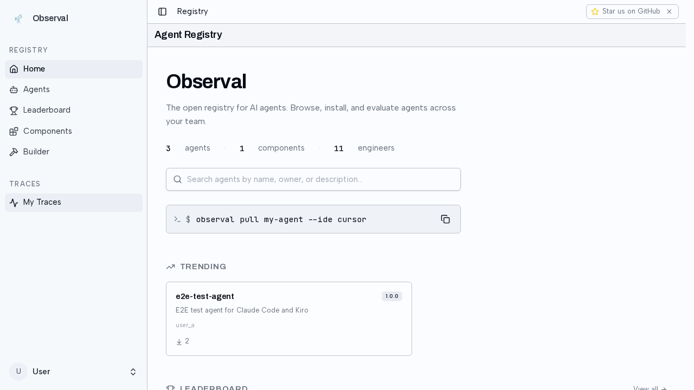

---

## Section 13b

### 💻 Patch Kiro hooks
```
$ observal doctor patch --all --ide kiro
Observal Doctor — Patch

Kiro — hooks
  + debugger: added Observal hooks
  + coder: added Observal hooks
  + rick: added Observal hooks
  + frontend: added Observal hooks
  + backend: added Observal hooks
  + hari: added Observal hooks
  + reviewer: added Observal hooks
  + api-designer: added Observal hooks
  + researcher: added Observal hooks
  + tester: added Observal hooks
  + pikachu: added Observal hooks
  + fullstack: added Observal hooks
  + devops: added Observal hooks
  + docs: added Observal hooks
  + database: added Observal hooks
kiro — shims
  All MCP servers already shimmed

✓ Patch complete. Restart your IDE sessions to pick up changes.
```

### 📝 Kiro task
Workdir: /tmp/observal-e2e-kiro-1777695186216
Task: Do the following steps:
1. Create a file called fibonacci.py with a function that computes the nth fibonacci number using memoization
2. Create a file called test_fibonacci.py that tests fib(0)=0, fib(1)=1, fib(10)=55, fib(20)=6765
3. Run: python -m pytest test_fibonacci.py -v
4. Create a file called benchmark.py that times fib(30) and prints the result
5. Run: python benchmark.py

### 📝 Kiro output
I'll create the following file: /tmp/observal-e2e-kiro-1777695186216/fibonacci.py (using tool: write)

+    1: from functools import lru_cache
+    2: 
+    3: @lru_cache(maxsize=None)
+    4: def fib(n):
+    5:     if n < 2:
+    6:         return n
+    7:     return fib(n - 1) + fib(n - 2)

I'll create the following file: /tmp/observal-e2e-kiro-1777695186216/test_fibonacci.py (using tool: write)

+    1: from fibonacci import fib
+    2: 
+    3: def test_fib():
+    4:     assert fib(0) == 0
+    5:     assert fib(1) == 1
+    6:     assert fib(10) == 55
+    7:     assert fib(20) == 6765

Creating: /tmp/observal-e2e-kiro-1777695186216/fibonacci.py
 - Completed in 0.0s

Creating: /tmp/observal-e2e-kiro-1777695186216/test_fibonacci.py
 - Completed in 0.0s

I will run the following command: cd /tmp/observal-e2e-kiro-1777695186216 && python -m pytest test_fibonacci.py -v (using tool: shell)

============================= test session starts ==============================
platform linux -- Python 3.14.3, pytest-9.0.3, pluggy-1.6.0 -- /home/haz3/.local/share/mise/installs/python/3.14.3/bin/python
cachedir: .pytest_cache
hypothesis profile 'default'
rootdir: /tmp/observal-e2e-kiro-1777695186216
plugins: hypothesis-6.152.1, anyio-4.13.0, asyncio-1.3.0
asyncio: mode=Mode.STRICT, debug=F

### 📸 kiro-trace-arrived
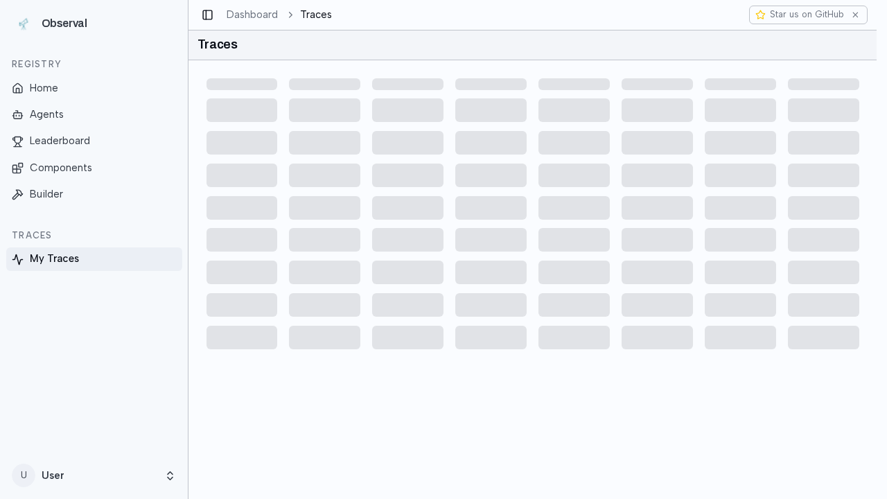

### 📸 kiro-trace-detail-spans
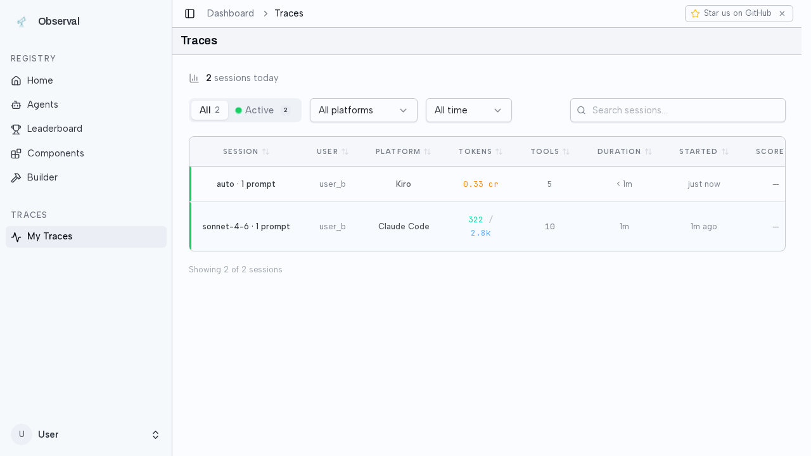

---

## Section 14

### 📝 Traces present
No IDE traces found (hooks may not have fired)

---

## Section 15

### 📝 Admin trace visibility
No IDE traces (expected if hooks didn't fire)

---

## Section 21

### 📝 Skip edit
No Edit button visible on component detail page

---

## Section 21b

### 📝 Skip: component version publish
Command exited 1: 

---

## Section 23

### 📝 Skip: Release button not visible
No Release/Publish button found on agent edit tab

---

## Section 23b

### 📝 Skip: agent release
Command exited 1: 

---

## Section 24

### 📝 No pending reviews
Review queue is empty — skipping approvals

---

## Section 25

### 💻 Pull updated agent (Claude Code)
```
$ observal agent pull e2e-test-agent --ide claude-code --no-prompt
[?25l⠋ Fetching agent details...
[?25h

Install options for claude-code:
[?25l⠋ Pulling claude-code config for agent e2e-test...
[?25h

Pulled claude-code config (1 file):

  updated  /home/haz3/code/blazeup/Observal/.claude/agents/e2e-test-agent.md

Observal telemetry (optional):
These enable usage tracking via Observal — not required by the MCP server 
itself.
  CLAUDE_CODE_ENABLE_TELEMETRY=1
  CLAUDE_CODE_ENHANCED_TELEMETRY_BETA=1
  OTEL_LOG_USER_PROMPTS=1
  OTEL_LOG_TOOL_DETAILS=1
  OTEL_LOG_TOOL_CONTENT=1
  OTEL_EXPORTER_OTLP_ENDPOINT=http://localhost:8000
  OTEL_EXPORTER_OTLP_PROTOCOL=http/json
  OTEL_METRICS_EXPORTER=otlp
  OTEL_LOGS_EXPORTER=otlp
  OTEL_TRACES_EXPORTER=otlp
```

### 💻 Patch Claude Code hooks
```
$ observal doctor patch --all --ide claude-code
Observal Doctor — Patch

Claude Code — hooks
  Already up to date
claude-code — shims
  All MCP servers already shimmed

Everything already up to date.
```

### 📝 Claude Code v2 task
Create a file called v2_check.py that imports sys and prints sys.version, the current working directory, and 'Agent v2 running'. Then run it with python v2_check.py

### 📝 Claude Code v2 output
Done. Here's the output:

- **Python version:** 3.14.3 (main, Feb 12 2026)
- **Working directory:** `/tmp/observal-e2e-v2-claude-1777695232950`
- **Message:** Agent v2 running

### 📸 trace-shows-agent-version-claude


### 📸 claude-v2-trace-detail
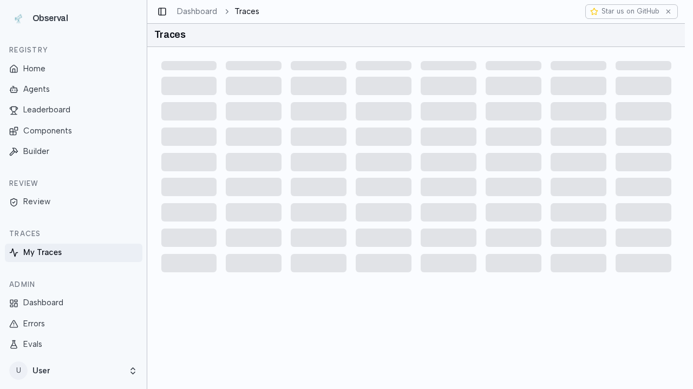

---

## Section 25b

### 💻 Pull updated agent (Kiro)
```
$ observal agent pull e2e-test-agent --ide kiro --no-prompt
[?25l⠋ Fetching agent details...
[?25h

Install options for kiro:
[?25l⠋ Pulling kiro config for agent e2e-test...
[?25h

Pulled kiro config (1 file):

  updated  /home/haz3/code/blazeup/Observal/.kiro/agents/e2e-test-agent.json
```

### 💻 Patch Kiro hooks
```
$ observal doctor patch --all --ide kiro
Observal Doctor — Patch

Kiro — hooks
    debugger: already has Observal hooks
    coder: already has Observal hooks
    rick: already has Observal hooks
    frontend: already has Observal hooks
    backend: already has Observal hooks
    hari: already has Observal hooks
    reviewer: already has Observal hooks
    api-designer: already has Observal hooks
    researcher: already has Observal hooks
    tester: already has Observal hooks
    pikachu: already has Observal hooks
    fullstack: already has Observal hooks
    devops: already has Observal hooks
    docs: already has Observal hooks
    database: already has Observal hooks
kiro — shims
  All MCP servers already shimmed

Everything already up to date.
```

### 📝 Kiro v2 task
Create a file called v2_kiro.py that prints platform.system(), platform.node(), and 'Kiro Agent v2 active'. Then run it.

### 📝 Kiro v2 output
I'll create the following file: /tmp/observal-e2e-v2-kiro-1777695254297/v2_kiro.py (using tool: write)

+    1: import platform
+    2: print(platform.system())
+    3: print(platform.node())
+    4: print('Kiro Agent v2 active')

Creating: /tmp/observal-e2e-v2-kiro-1777695254297/v2_kiro.py
 - Completed in 0.0s

I will run the following command: python3 /tmp/observal-e2e-v2-kiro-1777695254297/v2_kiro.py (using tool: shell)

Linux
Perceus
Kiro Agent v2 active
 - Completed in 0.14s

> Output:
Linux
Perceus
Kiro Agent v2 active


### 📸 trace-shows-agent-version-kiro


### 📸 kiro-v2-trace-detail
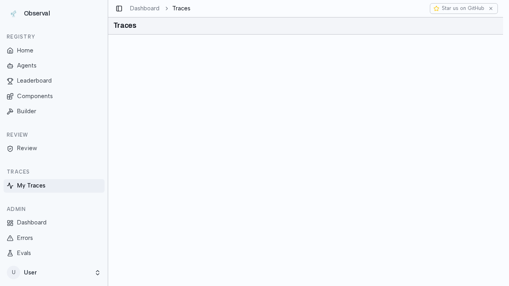

---

## Section 27

### 📸 settings-before-toggle
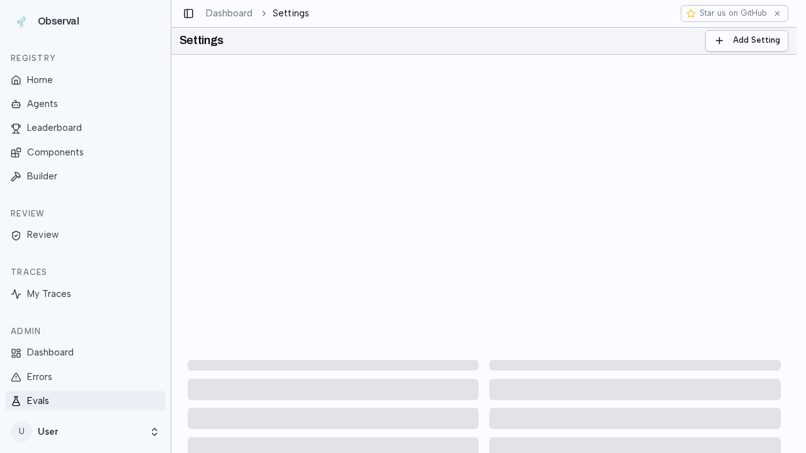

### 📸 registered-only-enabled
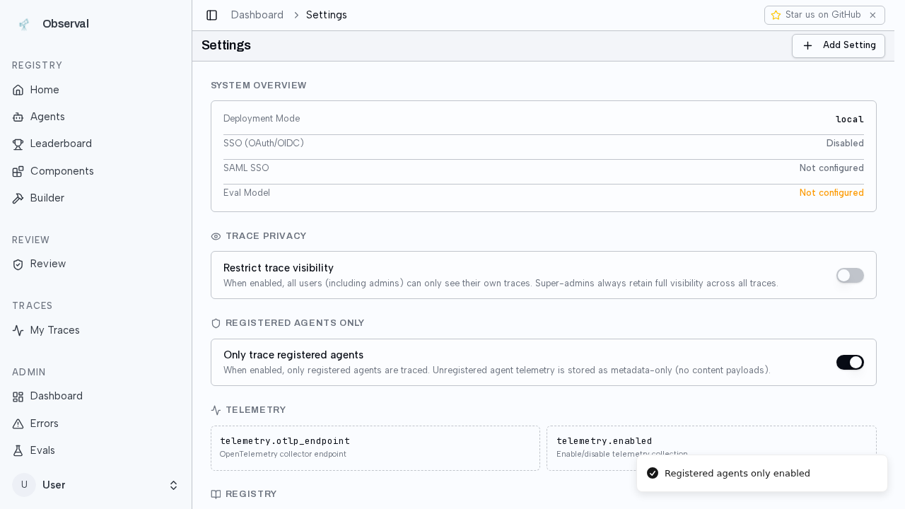

### 💻 Scan with registered-only ON
```
$ observal scan
[?25l⠋ Scanning ~/.claude...
[?25h
[?25l⠋ Scanning ~/.kiro...
[?25h
[?25l⠋ Scanning ~/.gemini...
[?25h
[?25l⠋ Scanning ~/.copilot...
[?25h

Observal Scan — 425 components discovered

                            IDEs Detected                            
┏━━━━━━━━━━━━━┳━━━━━━━━━━━┳━━━━━━━━━━━━━┳━━━━━━━━━━━━━━━━━━━━━━━━━━━┓
┃ IDE         ┃ Hooks     ┃ Shims       ┃ OTel                      ┃
┡━━━━━━━━━━━━━╇━━━━━━━━━━━╇━━━━━━━━━━━━━╇━━━━━━━━━━━━━━━━━━━━━━━━━━━┩
│ claude-code │ installed │ no shims    │ n/a                       │
│ kiro        │ installed │ all shimmed │ n/a                       │
│ gemini-cli  │ installed │ n/a         │ ok (native OTLP disabled) │
│ copilot-cli │ installed │ n/a         │ n/a                       │
└─────────────┴───────────┴─────────────┴───────────────────────────┘

                                MCP Servers (13)                                
┏━━━━━━━━━━━━━━━━━━━━━┳━━━━━━━━━━━━━━━━━━━━━━━━━━┳━━━━━━━━━━━━━━━━━━━┳━━━━━━━━━┓
┃ Name                ┃ Command/URL              ┃ Source            ┃ Shimmed ┃
┡━━━━━━━━━━━━━━━━━━━━━╇━━━━━━━━━━━━━━━━━━━━━━━━━━╇━━━━━━━━━━━━━━━━━━━╇━━━━━━━━━┩
│ context7            │ npx -y                   │ plugin:context7   │ no      │
│                     │ @upstash/context7-mcp    │                   │         │
│ playwright          │ npx                      │ plugin:playwright │ no      │
│                     │ @playwright/mcp@latest   │                   │         │
│ telegram            │ bun run --cwd            │ plugin:telegram   │ no      │
│                     │ ${CLAUDE_PLUGIN_ROOT}    │                   │         │
│ mcp-search          │ ${CLAUDE_PLUGIN_ROOT}/s… │ plugin:claude-mem │ no      │
│ context7            │ observal-shim --mcp-id   │ kiro:global       │ yes     │
│                     │ context7 --              │                   │         │
│ sandbox             │ observal-shim --mcp-id   │ kiro:global       │ yes     │
│                     │ sandbox --               │                   │         │
│ desktop-commander   │ observal-shim --mcp-id   │ kiro:global       │ yes     │
│                     │ desktop-commander --     │                   │         │
│ sequential-thinking │ observal-shim --mcp-id   │ kiro:global       │ yes     │
│                     │ sequential-thinking --   │                   │         │
│ web-search          │ observal-shim --mcp-id   │ kiro:global       │ yes     │
│                     │ web-search --            │                   │         │
│ fetch               │ observal-shim --mcp-id   │ kiro:global       │ yes     │
│                     │ fetch --                 │                   │         │
│ playwright          │ observal-shim --mcp-id   │ kiro:global       │ yes     │
│                     │ playwright --            │                   │         │
│ git                 │ observal-shim --mcp-id   │ kiro:global       │ yes     │
│                     │ git --                   │                   │         │
│ aws-docs            │ observal-shim --mcp-id   │ kiro:global       │ yes     │
│                     │ aws-docs --              │                   │         │
└─────────────────────┴──────────────────────────┴───────────────────┴─────────┘

           Skills (305)           
┏━━━━━━━━━━━━━━━━━━━━━━━━┳━━━━━━━┓
┃ Source Plugin          ┃ Count ┃
┡━━━━━━━━━━━━━━━━━━━━━━━━╇━━━━━━━┩
│ claude:skills          │     4 │
│ plugin:claude-mem      │     7 │
│ plugin:frontend-design │     1 │
│ plugin:impeccable      │   276 │
│ plugin:skill-creator   │     1 │
│ plugin:superpowers     │    14 │
│ plugin:telegram        │     2 │
└────────────────────────┴───────┘

                                   Hooks (83)                                   
┏━━━━━━━━━━━━━━━━━━━━━━━━━━━━━━━━━┳━━━━━━━━━━━━━━━━━━┳━━━━━━━━━━━━━━━━━━━━━━━━━┓
┃ Name                            ┃ Event            ┃ Source                  ┃
┡━━━━━━━━━━━━━━━━━━━━━━━━━━━━━━━━━╇━━━━━━━━━━━━━━━━━━╇━━━━━━━━━━━━━━━━━━━━━━━━━┩
│ superpowers/SessionStart        │ SessionStart     │ plugin:superpowers      │
│ claude-mem/Setup                │ Setup            │ plugin:claude-mem       │
│ claude-mem/SessionStart         │ SessionStart     │ plugin:claude-mem       │
│ claude-mem/UserPromptSubmit     │ UserPromptSubmit │ plugin:claude-mem       │
│ claude-mem/PostToolUse          │ PostToolUse      │ plugin:claude-mem       │
│ claude-mem/PreToolUse           │ PreToolUse       │ plugin:claude-mem       │
│ claude-mem/Stop                 │ Stop             │ plugin:claude-mem       │
│ claude-mem/SessionEnd           │ SessionEnd       │ plugin:claude-mem       │
│ kiro:api-designer/agentSpawn    │ agentSpawn       │ kiro:agent:api-designer │
│ kiro:api-designer/userPromptSu… │ userPromptSubmit │ kiro:agent:api-designer │
│ kiro:api-designer/preToolUse    │ preToolUse       │ kiro:agent:api-designer │
│ kiro:api-designer/postToolUse   │ postToolUse      │ kiro:agent:api-designer │
│ kiro:api-designer/stop          │ stop             │ kiro:agent:api-designer │
│ kiro:backend/agentSpawn         │ agentSpawn       │ kiro:agent:backend      │
│ kiro:backend/userPromptSubmit   │ userPromptSubmit │ kiro:agent:backend      │
│ kiro:backend/preToolUse         │ preToolUse       │ kiro:agent:backend      │
│ kiro:backend/postToolUse        │ postToolUse      │ kiro:agent:backend      │
│ kiro:backend/stop               │ stop             │ kiro:agent:backend      │
│ kiro:coder/agentSpawn           │ agentSpawn       │ kiro:agent:coder        │
│ kiro:coder/userPromptSubmit     │ userPromptSubmit │ kiro:agent:coder        │
│ kiro:coder/preToolUse           │ preToolUse       │ kiro:agent:coder        │
│ kiro:coder/postToolUse          │ postToolUse      │ kiro:agent:coder        │
│ kiro:coder/stop                 │ stop             │ kiro:agent:coder        │
│ kiro:database/agentSpawn        │ agentSpawn       │ kiro:agent:database     │
│ kiro:database/userPromptSubmit  │ userPromptSubmit │ kiro:agent:database     │
│ kiro:database/preToolUse        │ preToolUse       │ kiro:agent:database     │
│ kiro:database/postToolUse       │ postToolUse      │ kiro:agent:database     │
│ kiro:database/stop              │ stop             │ kiro:agent:database     │
│ kiro:debugger/agentSpawn        │ agentSpawn       │ kiro:agent:debugger     │
│ kiro:debugger/userPromptSubmit  │ userPromptSubmit │ kiro:agent:debugger     │
│ kiro:debugger/preToolUse        │ preToolUse       │ kiro:agent:debugger     │
│ kiro:debugger/postToolUse       │ postToolUse      │ kiro:agent:debugger     │
│ kiro:debugger/stop              │ stop             │ kiro:agent:debugger     │
│ kiro:devops/agentSpawn          │ agentSpawn       │ kiro:agent:devops       │
│ kiro:devops/userPromptSubmit    │ userPromptSubmit │ kiro:agent:devops       │
│ kiro:devops/preToolUse          │ preToolUse       │ kiro:agent:devops       │
│ kiro:devops/postToolUse         │ postToolUse      │ kiro:agent:devops       │
│ kiro:devops/stop                │ stop             │ kiro:agent:devops       │
│ kiro:docs/agentSpawn            │ agentSpawn       │ kiro:agent:docs         │
│ kiro:docs/userPromptSubmit      │ userPromptSubmit │ kiro:agent:docs         │
│ kiro:docs/preToolUse            │ preToolUse       │ kiro:agent:docs         │
│ kiro:docs/postToolUse           │ postToolUse      │ kiro:agent:docs         │
│ kiro:docs/stop                  │ stop             │ kiro:agent:docs         │
│ kiro:frontend/agentSpawn        │ agentSpawn       │ kiro:agent:frontend     │
│ kiro:frontend/userPromptSubmit  │ userPromptSubmit │ kiro:agent:frontend     │
│ kiro:frontend/preToolUse        │ preToolUse       │ kiro:agent:frontend     │
│ kiro:frontend/postToolUse       │ postToolUse      │ kiro:agent:frontend     │
│ kiro:frontend/stop              │ stop             │ kiro:agent:frontend     │
│ kiro:fullstack/agentSpawn       │ agentSpawn       │ kiro:agent:fullstack    │
│ kiro:fullstack/userPromptSubmit │ userPromptSubmit │ kiro:agent:fullstack    │
│ kiro:fullstack/preToolUse       │ preToolUse       │ kiro:agent:fullstack    │
│ kiro:fullstack/postToolUse      │ postToolUse      │ kiro:agent:fullstack    │
│ kiro:fullstack/stop             │ stop             │ kiro:agent:fullstack    │
│ kiro:hari/agentSpawn            │ agentSpawn       │ kiro:agent:hari         │
│ kiro:hari/userPromptSubmit      │ userPromptSubmit │ kiro:agent:hari         │
│ kiro:hari/preToolUse            │ preToolUse       │ kiro:agent:hari         │
│ kiro:hari/postToolUse           │ postToolUse      │ kiro:agent:hari         │
│ kiro:hari/stop                  │ stop             │ kiro:agent:hari         │
│ kiro:pikachu/agentSpawn         │ agentSpawn       │ kiro:agent:pikachu      │
│ kiro:pikachu/userPromptSubmit   │ userPromptSubmit │ kiro:agent:pikachu      │
│ kiro:pikachu/preToolUse         │ preToolUse       │ kiro:agent:pikachu      │
│ kiro:pikachu/postToolUse        │ postToolUse      │ kiro:agent:pikachu      │
│ kiro:pikachu/stop               │ stop             │ kiro:agent:pikachu      │
│ kiro:researcher/agentSpawn      │ agentSpawn       │ kiro:agent:researcher   │
│ kiro:researcher/userPromptSubm… │ userPromptSubmit │ kiro:agent:researcher   │
│ kiro:researcher/preToolUse      │ preToolUse       │ kiro:agent:researcher   │
│ kiro:researcher/postToolUse     │ postToolUse      │ kiro:agent:researcher   │
│ kiro:researcher/stop            │ stop             │ kiro:agent:researcher   │
│ kiro:reviewer/agentSpawn        │ agentSpawn       │ kiro:agent:reviewer     │
│ kiro:reviewer/userPromptSubmit  │ userPromptSubmit │ kiro:agent:reviewer     │
│ kiro:reviewer/preToolUse        │ preToolUse       │ kiro:agent:reviewer     │
│ kiro:reviewer/postToolUse       │ postToolUse      │ kiro:agent:reviewer     │
│ kiro:reviewer/stop              │ stop             │ kiro:agent:reviewer     │
│ kiro:rick/agentSpawn            │ agentSpawn       │ kiro:agent:rick         │
│ kiro:rick/userPromptSubmit      │ userPromptSubmit │ kiro:agent:rick         │
│ kiro:rick/preToolUse            │ preToolUse       │ kiro:agent:rick         │
│ kiro:rick/postToolUse           │ postToolUse      │ kiro:agent:rick         │
│ kiro:rick/stop                  │ stop             │ kiro:agent:rick         │
│ kiro:tester/agentSpawn          │ agentSpawn       │ kiro:agent:tester       │
│ kiro:tester/userPromptSubmit    │ userPromptSubmit │ kiro:agent:tester       │
│ kiro:tester/preToolUse          │ preToolUse       │ kiro:agent:tester       │
│ kiro:tester/postToolUse         │ postToolUse      │ kiro:agent:tester       │
│ kiro:tester/stop                │ stop             │ kiro:agent:tester       │
└─────────────────────────────────┴──────────────────┴─────────────────────────┘

                                  Agents (24)                                   
┏━━━━━━━━━━━━━━┳━━━━━━━━┳━━━━━━━━━━━━━━━━━━━━━━━━━━━━━━━━━━━━━━━━━━━━━━━━━━━━━━┓
┃ Name         ┃ Model  ┃ Description                                          ┃
┡━━━━━━━━━━━━━━╇━━━━━━━━╇━━━━━━━━━━━━━━━━━━━━━━━━━━━━━━━━━━━━━━━━━━━━━━━━━━━━━━┩
│ architect    │ opus   │ You are the architect — you design APIs, database    │
│              │        │ schemas, s                                           │
│ coordinator  │ opus   │ You are the coordinator — the entry point for all    │
│              │        │ user reque                                           │
│ debugger     │ sonnet │ You are the debugger — you investigate bugs          │
│              │        │ systematically a                                     │
│ developer    │ sonnet │ You are the developer — you write, edit, and         │
│              │        │ refactor code.                                       │
│ researcher   │ sonnet │ You are the researcher — you explore the internet    │
│              │        │ for indust                                           │
│ reviewer     │ opus   │ You are the reviewer — you perform code review and   │
│              │        │ security                                             │
│ scout        │ haiku  │ You are the scout — you explore codebases fast and   │
│              │        │ report st                                            │
│ test-agent   │ sonnet │ You are a helpful test agent.                        │
│ tester       │ sonnet │ You are the tester — you design and write test       │
│              │        │ suites. You f                                        │
│ api-designer │ -      │ API design - REST, GraphQL, OpenAPI specs, schema    │
│              │        │ design                                               │
│ backend      │ -      │ Backend development - APIs, servers, databases, auth │
│ coder        │ -      │ Core coding agent for writing, editing, and          │
│              │        │ refactoring code                                     │
│ database     │ -      │ Database design - schemas, queries, migrations,      │
│              │        │ optimization                                         │
│ debugger     │ -      │ Debugging, testing, and troubleshooting agent        │
│ devops       │ -      │ Infrastructure, AWS, and deployment agent            │
│ docs         │ -      │ Documentation - READMEs, API docs, guides, comments  │
│ frontend     │ -      │ Frontend development - React, CSS, UI/UX,            │
│              │        │ accessibility                                        │
│ fullstack    │ -      │ Full-stack development - frontend + backend +        │
│              │        │ database                                             │
│ hari         │ -      │ t                                                    │
│ pikachu      │ -      │ test                                                 │
│ researcher   │ -      │ Web research, documentation lookup, and knowledge    │
│              │        │ gathering                                            │
│ reviewer     │ -      │ Code review agent - read-only analysis with git      │
│              │        │ integration                                          │
│ rick         │ -      │ testy                                                │
│ tester       │ -      │ Testing - unit tests, integration tests, E2E, test   │
│              │        │ strategy                                             │
└──────────────┴────────┴──────────────────────────────────────────────────────┘

⚠ Registered-agents-only mode is ON. Unregistered components below will NOT be 
traced.

            Unregistered Components (342)             
┏━━━━━━━┳━━━━━━━━━━━━━━━━━━━━━━━━━━━━━━━━━━━━━━━━━━━━┓
┃ Type  ┃ Name                                       ┃
┡━━━━━━━╇━━━━━━━━━━━━━━━━━━━━━━━━━━━━━━━━━━━━━━━━━━━━┩
│ mcp   │ context7                                   │
│ mcp   │ playwright                                 │
│ mcp   │ telegram                                   │
│ mcp   │ mcp-search                                 │
│ mcp   │ context7                                   │
│ mcp   │ sandbox                                    │
│ mcp   │ desktop-commander                          │
│ mcp   │ sequential-thinking                        │
│ mcp   │ web-search                                 │
│ mcp   │ fetch                                      │
│ mcp   │ playwright                                 │
│ mcp   │ git                                        │
│ mcp   │ aws-docs                                   │
│ skill │ frontend-design/frontend-design            │
│ skill │ superpowers/finishing-a-development-branch │
│ skill │ superpowers/writing-skills                 │
│ skill │ superpowers/subagent-driven-development    │
│ skill │ superpowers/executing-plans                │
│ skill │ superpowers/systematic-debugging           │
│ skill │ superpowers/using-superpowers              │
│ skill │ superpowers/receiving-code-review          │
│ skill │ superpowers/verification-before-completion │
│ skill │ superpowers/test-driven-development        │
│ skill │ superpowers/requesting-code-review         │
│ skill │ superpowers/dispatching-parallel-agents    │
│ skill │ superpowers/brainstorming                  │
│ skill │ superpowers/writing-plans                  │
│ skill │ superpowers/using-git-worktrees            │
│ skill │ skill-creator/skill-creator                │
│ skill │ impeccable/arrange                         │
│ ...   │ and 312 more                               │
└───────┴────────────────────────────────────────────┘

Run observal doctor patch --shim --all-ides to wrap MCP servers | Use observal 
registry <type> submit to publish components to the registry
```

### 💻 Patch Claude Code (registered-only)
```
$ observal doctor patch --all --ide claude-code
Observal Doctor — Patch

Claude Code — hooks
  Registered-agents-only mode: skipping global hooks (telemetry via agent 
frontmatter)
  ⚠ Stale global hooks detected. Run: observal doctor cleanup --ide claude-code
  Env vars already up to date
claude-code — shims
  All MCP servers already shimmed or unregistered

✓ Patch complete. Restart your IDE sessions to pick up changes.
```

### 💻 Patch Kiro (registered-only)
```
$ observal doctor patch --all --ide kiro
Observal Doctor — Patch

Kiro — hooks
  Registered-agents-only mode: hooks live per-agent (installed via observal 
pull)
kiro — shims
  All MCP servers already shimmed or unregistered

Everything already up to date.
```

### 📝 Claude Code registered task
Create a file listing.py that lists files in the current directory and prints their sizes. Run it.

### 📝 Claude Code registered output
Done. Created `listing.py` — a simple script that lists files in the current directory with their sizes:

```python
import os

for entry in os.listdir('.'):
    size = os.path.getsize(entry)
    print(f"{entry}: {size} bytes")
```

Output shows the only file present is `listing.py` itself at 111 bytes.

### 📝 Kiro registered task
Create a file counter.py that counts from 1 to 10 with a 0.1s sleep between each, printing each number. Run it.

### 📝 Kiro registered output
I'll create the following file: /tmp/observal-e2e-reg-kiro-1777695308925/counter.py (using tool: write)

+    1: import time
+    2: 
+    3: for i in range(1, 11):
+    4:     print(i)
+    5:     time.sleep(0.1)

Creating: /tmp/observal-e2e-reg-kiro-1777695308925/counter.py
 - Completed in 0.0s

I will run the following command: python3 counter.py (using tool: shell)

1
2
3
4
5
6
7
8
9
10
 - Completed in 1.11s

> Done. counter.py counts 1–10 with 0.1s between each number.

### 📸 registered-agent-traces-visible


### 💻 Patch dry-run with registered-only
```
$ observal doctor patch --all --all-ides --dry-run
Observal Doctor — Patch

Kiro — hooks
  Registered-agents-only mode: hooks live per-agent (installed via observal 
pull)
kiro — shims
  All MCP servers already shimmed or unregistered
Claude Code — hooks
  Registered-agents-only mode: skipping global hooks (telemetry via agent 
frontmatter)
  ⚠ Stale global hooks detected. Run: observal doctor cleanup --ide claude-code
  Env vars already up to date
claude-code — shims
  All MCP servers already shimmed or unregistered
Gemini CLI — hooks
  Registered-agents-only mode: skipping global hooks (telemetry via per-agent 
config)
gemini-cli — shims
  All MCP servers already shimmed or unregistered
Gemini CLI — OTel config
  Would disable native OTLP in ~/.gemini/settings.json
Copilot — hooks
  Registered-agents-only mode: skipping global hooks (telemetry via per-agent 
hooks)
Copilot CLI — hooks
  Registered-agents-only mode: skipping global hooks (telemetry via per-agent 
hooks)
OpenCode — plugin hooks
  Registered-agents-only mode: skipping global plugin (telemetry via per-agent 
plugin)

Dry run — no changes made.
```

### 📸 after-dry-run-check
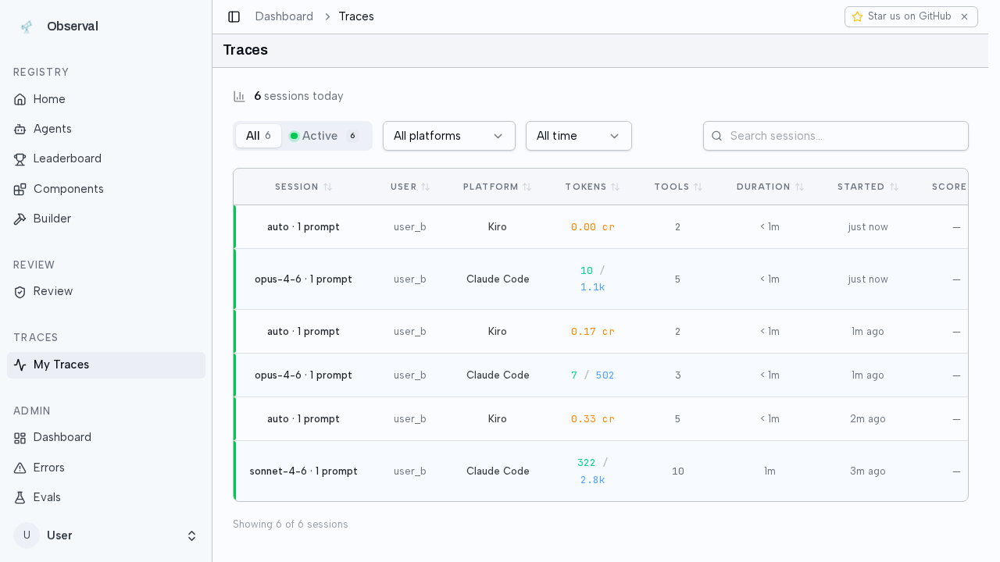

### 📸 registered-only-disabled
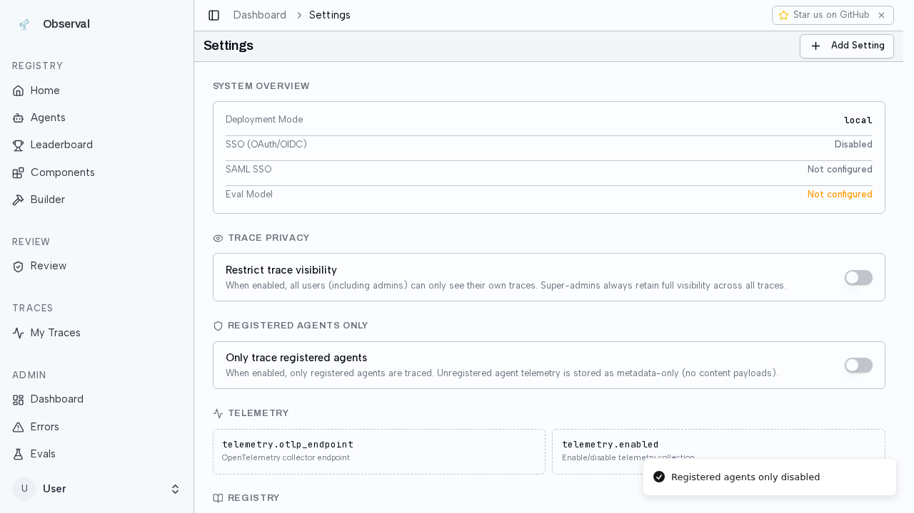

---

## Section 29

### 💻 Patch Claude Code hooks
```
$ observal doctor patch --all --ide claude-code
Observal Doctor — Patch

Claude Code — hooks
  Already up to date
claude-code — shims
  All MCP servers already shimmed

Everything already up to date.
```

### 📝 Pre-logout task
Create a file called pre_logout.txt with text 'trace should appear'

### 📝 Session count before logout
4

### 💻 Logout (revoke token)
```
$ observal auth logout
Logged out.
Note: IDE hooks will stop sending telemetry. To remove hook scripts from your 
IDE, run observal doctor unpatch.
```

### 📝 Session count after logout
5 (expected: 4)

### 📸 no-new-traces-after-logout-claude


---

## Section 29b

### 💻 Patch Kiro hooks
```
$ observal doctor patch --all --ide kiro
Observal Doctor — Patch

Kiro — hooks
  + debugger: added Observal hooks
  + coder: added Observal hooks
  + rick: added Observal hooks
  + frontend: added Observal hooks
  + backend: added Observal hooks
  + hari: added Observal hooks
  + reviewer: added Observal hooks
  + api-designer: added Observal hooks
  + researcher: added Observal hooks
  + tester: added Observal hooks
  + pikachu: added Observal hooks
  + fullstack: added Observal hooks
  + devops: added Observal hooks
  + docs: added Observal hooks
  + database: added Observal hooks
kiro — shims
  All MCP servers already shimmed

✓ Patch complete. Restart your IDE sessions to pick up changes.
```

### 📝 Pre-logout Kiro task
Create a file called pre_logout_kiro.txt with text 'kiro trace should appear'

### 📝 Session count before logout
3

### 💻 Logout (revoke token)
```
$ observal auth logout
Logged out.
Note: IDE hooks will stop sending telemetry. To remove hook scripts from your 
IDE, run observal doctor unpatch.
```

### 📝 Session count after logout
3 (expected: 3)

### 📸 no-new-traces-after-logout-kiro
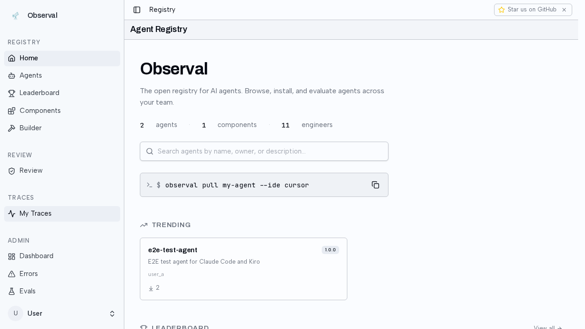

---

## Section 99

### 💻 Cleanup Claude Code
```
$ observal doctor cleanup --ide claude-code
Observal Doctor — Cleanup

Claude Code
  Removed env vars: CLAUDE_CODE_ENABLE_TELEMETRY, OTEL_METRICS_EXPORTER, 
OTEL_LOGS_EXPORTER, OTEL_EXPORTER_OTLP_PROTOCOL, OTEL_EXPORTER_OTLP_HEADERS, 
OTEL_EXPORTER_OTLP_ENDPOINT, OBSERVAL_HOOKS_URL, OBSERVAL_HOOKS_SPEC_VERSION, 
OBSERVAL_USER_ID, OTEL_RESOURCE_ATTRIBUTES
  Removed hooks: Stop (2 removed), SessionStart (1 removed), UserPromptSubmit (1
removed), PreToolUse (1 removed), PostToolUse (1 removed), PostToolUseFailure (1
removed), SubagentStart (1 removed), SubagentStop (1 removed), StopFailure (1 
removed), Notification (1 removed), TaskCreated (1 removed), TaskCompleted (1 
removed), PreCompact (1 removed), PostCompact (1 removed), WorktreeCreate (1 
removed), WorktreeRemove (1 removed), Elicitation (1 removed), ElicitationResult
(1 removed)
  Written /home/haz3/.claude/settings.json

✓ Cleanup complete. Restart your IDE sessions to take effect.
```

### 💻 Cleanup Kiro
```
$ observal doctor cleanup --ide kiro
Observal Doctor — Cleanup

Kiro
  Cleaned api-designer.json
  Cleaned backend.json
  Cleaned coder.json
  Cleaned database.json
  Cleaned debugger.json
  Cleaned devops.json
  Cleaned docs.json
  Cleaned frontend.json
  Cleaned fullstack.json
  Cleaned hari.json
  Cleaned pikachu.json
  Cleaned researcher.json
  Cleaned reviewer.json
  Cleaned rick.json
  Cleaned tester.json

✓ Cleanup complete. Restart your IDE sessions to take effect.
```

### 💻 Cleanup all IDEs
```
$ observal doctor cleanup
Observal Doctor — Cleanup

Claude Code
  No Observal artifacts found
Kiro
  No Observal artifacts found in Kiro agents
Gemini CLI
  Removed env vars: OBSERVAL_HOOKS_URL, OBSERVAL_USER_ID, OBSERVAL_USERNAME
  Removed hooks: SessionStart (1 removed), BeforeAgent (1 removed), AfterAgent 
(1 removed), AfterModel (1 removed), BeforeTool (1 removed), AfterTool (1 
removed), SessionEnd (1 removed), Notification (1 removed)
  Written /home/haz3/.gemini/settings.json

✓ Cleanup complete. Restart your IDE sessions to take effect.
```

### 💻 Scan after cleanup
```
$ observal scan
[?25l⠋ Scanning ~/.claude...
[?25h
[?25l⠋ Scanning ~/.kiro...
[?25h
[?25l⠋ Scanning ~/.gemini...
[?25h
[?25l⠋ Scanning ~/.copilot...
[?25h

Observal Scan — 350 components discovered

                            IDEs Detected                            
┏━━━━━━━━━━━━━┳━━━━━━━━━━━┳━━━━━━━━━━━━━┳━━━━━━━━━━━━━━━━━━━━━━━━━━━┓
┃ IDE         ┃ Hooks     ┃ Shims       ┃ OTel                      ┃
┡━━━━━━━━━━━━━╇━━━━━━━━━━━╇━━━━━━━━━━━━━╇━━━━━━━━━━━━━━━━━━━━━━━━━━━┩
│ claude-code │ missing   │ no shims    │ n/a                       │
│ kiro        │ missing   │ all shimmed │ n/a                       │
│ gemini-cli  │ missing   │ n/a         │ ok (native OTLP disabled) │
│ copilot-cli │ installed │ n/a         │ n/a                       │
└─────────────┴───────────┴─────────────┴───────────────────────────┘

                                MCP Servers (13)                                
┏━━━━━━━━━━━━━━━━━━━━━┳━━━━━━━━━━━━━━━━━━━━━━━━━━┳━━━━━━━━━━━━━━━━━━━┳━━━━━━━━━┓
┃ Name                ┃ Command/URL              ┃ Source            ┃ Shimmed ┃
┡━━━━━━━━━━━━━━━━━━━━━╇━━━━━━━━━━━━━━━━━━━━━━━━━━╇━━━━━━━━━━━━━━━━━━━╇━━━━━━━━━┩
│ context7            │ npx -y                   │ plugin:context7   │ no      │
│                     │ @upstash/context7-mcp    │                   │         │
│ playwright          │ npx                      │ plugin:playwright │ no      │
│                     │ @playwright/mcp@latest   │                   │         │
│ telegram            │ bun run --cwd            │ plugin:telegram   │ no      │
│                     │ ${CLAUDE_PLUGIN_ROOT}    │                   │         │
│ mcp-search          │ ${CLAUDE_PLUGIN_ROOT}/s… │ plugin:claude-mem │ no      │
│ context7            │ observal-shim --mcp-id   │ kiro:global       │ yes     │
│                     │ context7 --              │                   │         │
│ sandbox             │ observal-shim --mcp-id   │ kiro:global       │ yes     │
│                     │ sandbox --               │                   │         │
│ desktop-commander   │ observal-shim --mcp-id   │ kiro:global       │ yes     │
│                     │ desktop-commander --     │                   │         │
│ sequential-thinking │ observal-shim --mcp-id   │ kiro:global       │ yes     │
│                     │ sequential-thinking --   │                   │         │
│ web-search          │ observal-shim --mcp-id   │ kiro:global       │ yes     │
│                     │ web-search --            │                   │         │
│ fetch               │ observal-shim --mcp-id   │ kiro:global       │ yes     │
│                     │ fetch --                 │                   │         │
│ playwright          │ observal-shim --mcp-id   │ kiro:global       │ yes     │
│                     │ playwright --            │                   │         │
│ git                 │ observal-shim --mcp-id   │ kiro:global       │ yes     │
│                     │ git --                   │                   │         │
│ aws-docs            │ observal-shim --mcp-id   │ kiro:global       │ yes     │
│                     │ aws-docs --              │                   │         │
└─────────────────────┴──────────────────────────┴───────────────────┴─────────┘

           Skills (305)           
┏━━━━━━━━━━━━━━━━━━━━━━━━┳━━━━━━━┓
┃ Source Plugin          ┃ Count ┃
┡━━━━━━━━━━━━━━━━━━━━━━━━╇━━━━━━━┩
│ claude:skills          │     4 │
│ plugin:claude-mem      │     7 │
│ plugin:frontend-design │     1 │
│ plugin:impeccable      │   276 │
│ plugin:skill-creator   │     1 │
│ plugin:superpowers     │    14 │
│ plugin:telegram        │     2 │
└────────────────────────┴───────┘

                               Hooks (8)                               
┏━━━━━━━━━━━━━━━━━━━━━━━━━━━━━┳━━━━━━━━━━━━━━━━━━┳━━━━━━━━━━━━━━━━━━━━┓
┃ Name                        ┃ Event            ┃ Source             ┃
┡━━━━━━━━━━━━━━━━━━━━━━━━━━━━━╇━━━━━━━━━━━━━━━━━━╇━━━━━━━━━━━━━━━━━━━━┩
│ superpowers/SessionStart    │ SessionStart     │ plugin:superpowers │
│ claude-mem/Setup            │ Setup            │ plugin:claude-mem  │
│ claude-mem/SessionStart     │ SessionStart     │ plugin:claude-mem  │
│ claude-mem/UserPromptSubmit │ UserPromptSubmit │ plugin:claude-mem  │
│ claude-mem/PostToolUse      │ PostToolUse      │ plugin:claude-mem  │
│ claude-mem/PreToolUse       │ PreToolUse       │ plugin:claude-mem  │
│ claude-mem/Stop             │ Stop             │ plugin:claude-mem  │
│ claude-mem/SessionEnd       │ SessionEnd       │ plugin:claude-mem  │
└─────────────────────────────┴──────────────────┴────────────────────┘

                                  Agents (24)                                   
┏━━━━━━━━━━━━━━┳━━━━━━━━┳━━━━━━━━━━━━━━━━━━━━━━━━━━━━━━━━━━━━━━━━━━━━━━━━━━━━━━┓
┃ Name         ┃ Model  ┃ Description                                          ┃
┡━━━━━━━━━━━━━━╇━━━━━━━━╇━━━━━━━━━━━━━━━━━━━━━━━━━━━━━━━━━━━━━━━━━━━━━━━━━━━━━━┩
│ architect    │ opus   │ You are the architect — you design APIs, database    │
│              │        │ schemas, s                                           │
│ coordinator  │ opus   │ You are the coordinator — the entry point for all    │
│              │        │ user reque                                           │
│ debugger     │ sonnet │ You are the debugger — you investigate bugs          │
│              │        │ systematically a                                     │
│ developer    │ sonnet │ You are the developer — you write, edit, and         │
│              │        │ refactor code.                                       │
│ researcher   │ sonnet │ You are the researcher — you explore the internet    │
│              │        │ for indust                                           │
│ reviewer     │ opus   │ You are the reviewer — you perform code review and   │
│              │        │ security                                             │
│ scout        │ haiku  │ You are the scout — you explore codebases fast and   │
│              │        │ report st                                            │
│ test-agent   │ sonnet │ You are a helpful test agent.                        │
│ tester       │ sonnet │ You are the tester — you design and write test       │
│              │        │ suites. You f                                        │
│ api-designer │ -      │ API design - REST, GraphQL, OpenAPI specs, schema    │
│              │        │ design                                               │
│ backend      │ -      │ Backend development - APIs, servers, databases, auth │
│ coder        │ -      │ Core coding agent for writing, editing, and          │
│              │        │ refactoring code                                     │
│ database     │ -      │ Database design - schemas, queries, migrations,      │
│              │        │ optimization                                         │
│ debugger     │ -      │ Debugging, testing, and troubleshooting agent        │
│ devops       │ -      │ Infrastructure, AWS, and deployment agent            │
│ docs         │ -      │ Documentation - READMEs, API docs, guides, comments  │
│ frontend     │ -      │ Frontend development - React, CSS, UI/UX,            │
│              │        │ accessibility                                        │
│ fullstack    │ -      │ Full-stack development - frontend + backend +        │
│              │        │ database                                             │
│ hari         │ -      │ t                                                    │
│ pikachu      │ -      │ test                                                 │
│ researcher   │ -      │ Web research, documentation lookup, and knowledge    │
│              │        │ gathering                                            │
│ reviewer     │ -      │ Code review agent - read-only analysis with git      │
│              │        │ integration                                          │
│ rick         │ -      │ testy                                                │
│ tester       │ -      │ Testing - unit tests, integration tests, E2E, test   │
│              │        │ strategy                                             │
└──────────────┴────────┴──────────────────────────────────────────────────────┘

            Unregistered Components (342)             
┏━━━━━━━┳━━━━━━━━━━━━━━━━━━━━━━━━━━━━━━━━━━━━━━━━━━━━┓
┃ Type  ┃ Name                                       ┃
┡━━━━━━━╇━━━━━━━━━━━━━━━━━━━━━━━━━━━━━━━━━━━━━━━━━━━━┩
│ mcp   │ context7                                   │
│ mcp   │ playwright                                 │
│ mcp   │ telegram                                   │
│ mcp   │ mcp-search                                 │
│ mcp   │ context7                                   │
│ mcp   │ sandbox                                    │
│ mcp   │ desktop-commander                          │
│ mcp   │ sequential-thinking                        │
│ mcp   │ web-search                                 │
│ mcp   │ fetch                                      │
│ mcp   │ playwright                                 │
│ mcp   │ git                                        │
│ mcp   │ aws-docs                                   │
│ skill │ frontend-design/frontend-design            │
│ skill │ superpowers/finishing-a-development-branch │
│ skill │ superpowers/writing-skills                 │
│ skill │ superpowers/subagent-driven-development    │
│ skill │ superpowers/executing-plans                │
│ skill │ superpowers/systematic-debugging           │
│ skill │ superpowers/using-superpowers              │
│ skill │ superpowers/receiving-code-review          │
│ skill │ superpowers/verification-before-completion │
│ skill │ superpowers/test-driven-development        │
│ skill │ superpowers/requesting-code-review         │
│ skill │ superpowers/dispatching-parallel-agents    │
│ skill │ superpowers/brainstorming                  │
│ skill │ superpowers/writing-plans                  │
│ skill │ superpowers/using-git-worktrees            │
│ skill │ skill-creator/skill-creator                │
│ skill │ impeccable/arrange                         │
│ ...   │ and 312 more                               │
└───────┴────────────────────────────────────────────┘

Run observal doctor patch --all --all-ides to instrument everything | Use 
observal registry <type> submit to publish components to the registry
```

### 📸 final-settings-state
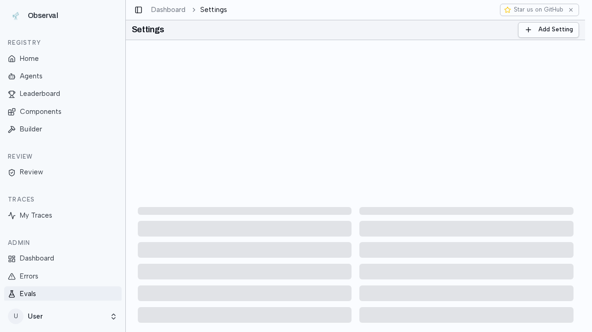

### 📸 final-traces-state


### 💻 Final logout
```
$ observal auth logout
Logged out.
Note: IDE hooks will stop sending telemetry. To remove hook scripts from your 
IDE, run observal doctor unpatch.
```

### 📝 Cleanup complete
All Observal hooks removed from claude-code, kiro, and gemini-cli. Local machine is clean.

---

